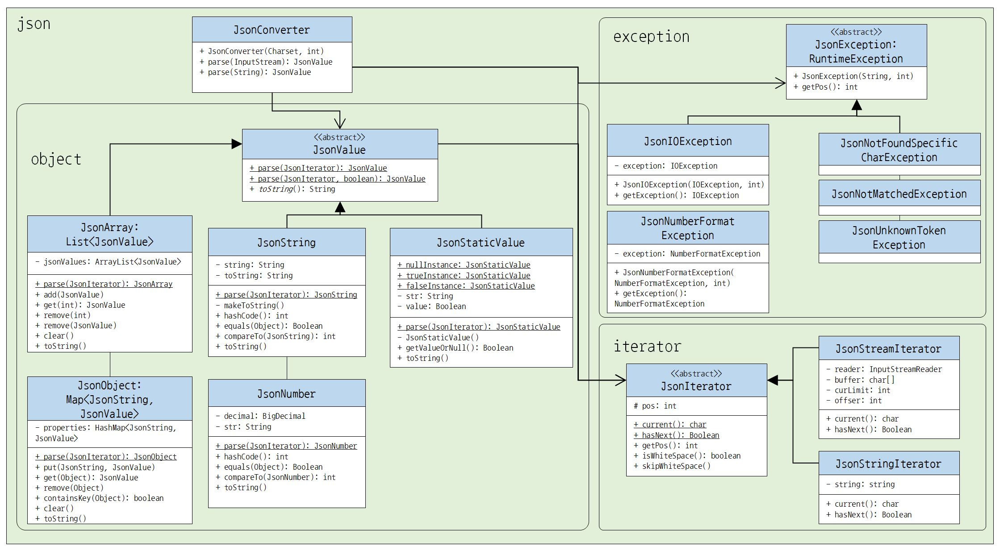

# Java Json Parser Project

- Purpose : studying to know json architecture and parsing algorithm (without any logical supports but it used standard library like ArrayList)
- Language : Java

    ※ reference : https://www.json.org/json-ko.html (just to know the architecture and the rules to parse that)

- Features
    - Providing a stream iterator such as memory, network, file etc. (It doesn't use lots of momery)
    - A design for expanding. (highly abstract classes)
    - Supporting for serialization and deserialization. (Json to Java Object, Java Object to Json String)

- Example

```Java
JsonConverter parser = new JsonConverter(StandardCharsets.UTF_8);

try (FileInputStream is = new FileInputStream("../sample/generated.json")) {
    JsonArray ary = parser.parse(is);

    for (JsonValue value: ary) {
        System.out.println(value);
    }
}
```

- Class Design

